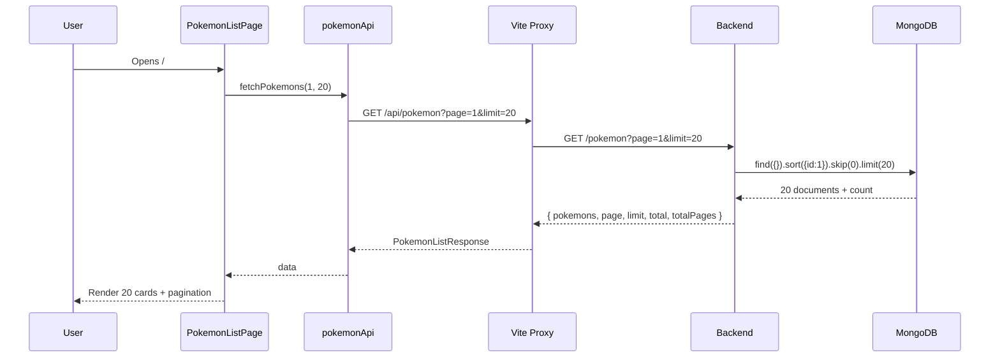
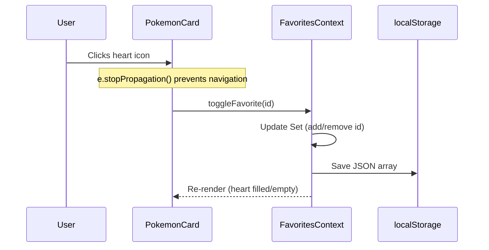
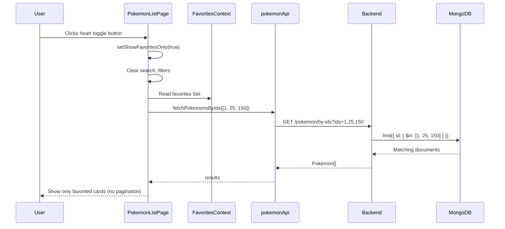
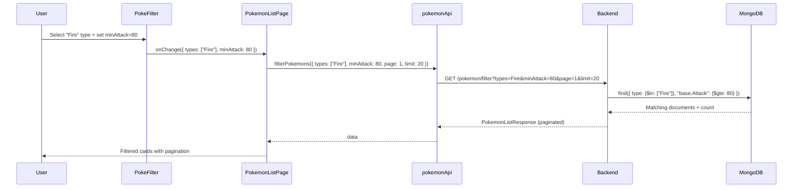
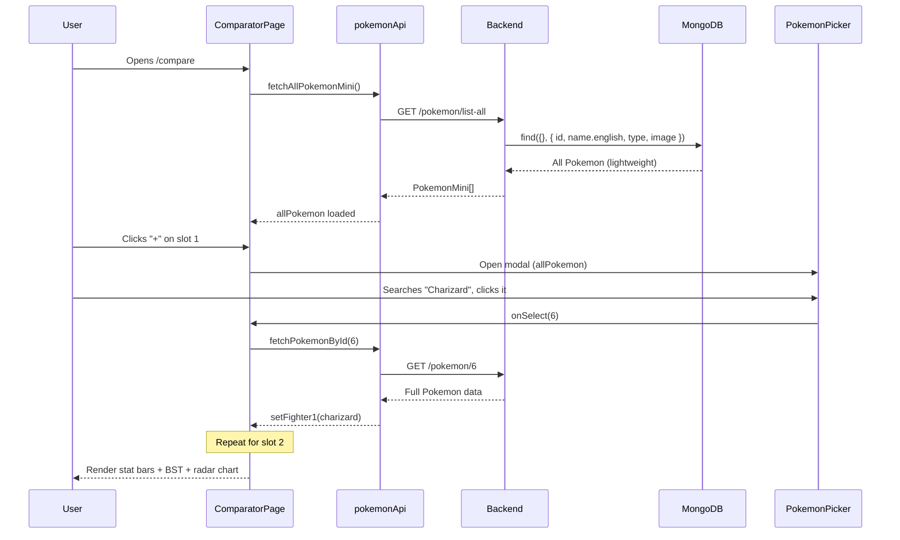
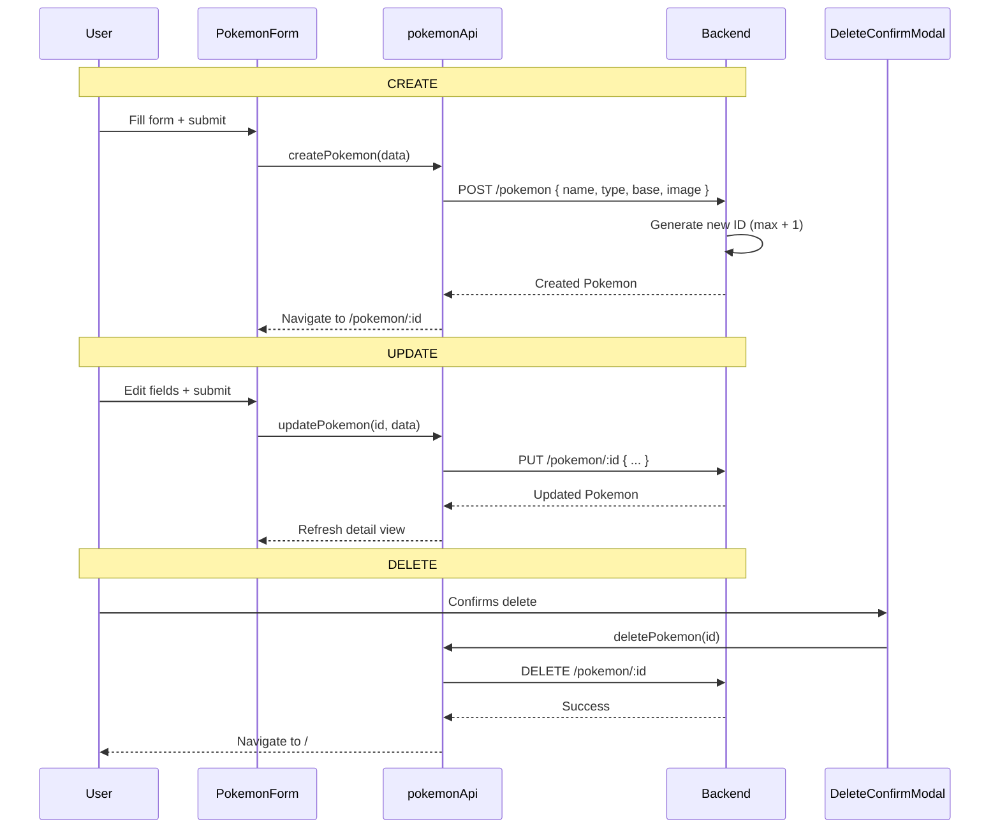

# PokeStats - Technical Documentation

Detailed technical guide covering architecture, component structure, data flows, and state management.

## Table of Contents

1. [Architecture](#architecture)
2. [File Structure](#file-structure)
3. [Routing](#routing)
4. [State Management](#state-management)
5. [Data Flows](#data-flows)
6. [API Service Layer](#api-service-layer)
7. [Components](#components)
8. [TypeScript Interfaces](#typescript-interfaces)
9. [Styling System](#styling-system)
10. [Performance](#performance)

---

## Architecture

### Overview

```
Browser
  │
  ├── React App (Vite dev server, port 5173)
  │     ├── React Router (client-side routing)
  │     ├── FavoritesContext (React Context + localStorage)
  │     └── Components → pokemonApi.ts service layer
  │                           │
  │                     /api/* proxy (Vite)
  │                           │
  └───────────────────── Express Backend (port 3000)
                              │
                         MongoDB (port 27017, db: pokebdd)
```

### Key Architectural Decisions

| Decision | Choice | Rationale |
|----------|--------|-----------|
| State management | React Context (favorites) + local component state | Simple app, no need for Redux |
| API communication | Vite proxy (`/api` -> `localhost:3000`) | Avoids CORS, clean URL structure |
| Styling | Tailwind via CDN + custom CSS classes | Fast prototyping, no build step for styles |
| Favorites storage | `localStorage` (client-side) | No user auth needed, instant persistence |
| Filtering | Server-side (MongoDB queries) | Handles large datasets, returns paginated results |
| Comparator picker | Client-side filtering of full lightweight list | Instant search UX, small payload (~80KB) |

---

## File Structure

### Root Files

| File | Purpose |
|------|---------|
| `index.html` | HTML shell with Tailwind CDN, Patrick Hand font, custom CSS classes |
| `index.tsx` | React entry point: `ReactDOM.createRoot`, wraps app in `BrowserRouter` + `FavoritesProvider` |
| `App.tsx` | Top-level layout: fixed navbar with logo/links, `<Routes>` for page rendering |
| `types.ts` | All TypeScript interfaces (`Pokemon`, `PokemonListResponse`, `PokemonFormData`, `PokemonMini`, `FilterParams`) and `TYPE_COLORS` constant |
| `vite.config.ts` | Vite configuration: React plugin, `/api` proxy to backend, path alias `@/` |
| `tsconfig.json` | TypeScript config. Excludes legacy files: `BattleArena.tsx`, `TradingCard.tsx`, `PokemonCardGenerator.tsx` |

### Components

| Component | Route/Usage | Description |
|-----------|-------------|-------------|
| `PokemonListPage.tsx` | `/` | Main page: search bar, filter/favorites toggles, paginated card grid |
| `PokemonDetailPage.tsx` | `/pokemon/:id` | Single Pokemon view: image, types, stats bars, radar chart, edit form, delete modal |
| `AddPokemonPage.tsx` | `/pokemon/new` | Create page wrapping `PokemonForm` |
| `ComparatorPage.tsx` | `/compare` | Two-slot comparator: fighter selection, stat bars, BST total, overlaid radar chart |
| `PokemonCard.tsx` | Used by `PokemonListPage` | TCG-style card: image, name, type dot, HP, attack stat, favorite heart |
| `PokemonForm.tsx` | Used by `AddPokemonPage` and `PokemonDetailPage` | Reusable form: 4 name fields, 18 type toggles, 6 stat inputs, image URL |
| `StatChart.tsx` | Used by `PokemonDetailPage` | Single-Pokemon radar chart using Recharts (`RadarChart`) |
| `DeleteConfirmModal.tsx` | Used by `PokemonDetailPage` | Overlay modal with confirm/cancel buttons |
| `PokeFilter.tsx` | Used by `PokemonListPage` | Filter panel: 18 type toggle buttons + 6 stat min/max input rows |
| `PokemonPicker.tsx` | Used by `ComparatorPage` | Overlay modal: search input + scrollable grid of mini-cards for selection |

### Contexts

| Context | File | API |
|---------|------|-----|
| Favorites | `contexts/FavoritesContext.tsx` | `toggleFavorite(id)`, `isFavorite(id)`, `favorites` (Set), `clearFavorites()` |

### Services

| File | Functions |
|------|-----------|
| `services/pokemonApi.ts` | `fetchPokemons`, `searchPokemons`, `fetchPokemonById`, `createPokemon`, `updatePokemon`, `deletePokemon`, `fetchPokemonsByIds`, `filterPokemons`, `fetchAllPokemonMini` |

---

## Routing

Defined in `App.tsx` using React Router v7:

| Path | Component | Description |
|------|-----------|-------------|
| `/` | `PokemonListPage` | Paginated list with search, filters, favorites |
| `/pokemon/new` | `AddPokemonPage` | Create new Pokemon form |
| `/compare` | `ComparatorPage` | Side-by-side stats comparator |
| `/pokemon/:id` | `PokemonDetailPage` | View/edit/delete single Pokemon |

**Route order matters**: `/pokemon/new` and `/compare` are defined before `/pokemon/:id` so they don't get captured by the `:id` parameter.

### Navigation

The navbar (`App.tsx`) provides:
- **Logo** (PokeStats) -> links to `/`
- **Compare** button (Swords icon) -> links to `/compare`
- **Add Pokemon** button (Plus icon) -> links to `/pokemon/new`

Card clicks in the list use `useNavigate` to push `/pokemon/{id}`.

---

## State Management

### Global State: FavoritesContext

```
FavoritesProvider (wraps entire app via index.tsx)
  │
  ├── State: Set<number> of Pokemon IDs
  ├── Persistence: localStorage key "pokestats-favorites" (JSON array)
  │
  └── Consumers:
      ├── PokemonCard.tsx       (heart icon toggle)
      ├── PokemonDetailPage.tsx (heart button)
      └── PokemonListPage.tsx   (favorites-only mode, re-fetch on change)
```

### Component-Level State

**PokemonListPage** (most complex state):
```typescript
pokemons: Pokemon[]          // Current displayed list
loading: boolean             // Loading spinner
page: number                 // Current page
totalPages: number           // Total pages from backend
searchTerm: string           // Search input value
isSearching: boolean         // Whether in search mode
showFavoritesOnly: boolean   // Favorites-only mode toggle
showFilters: boolean         // Filter panel visibility
filters: FilterParams        // Active filter values
```

**PokemonDetailPage**:
```typescript
pokemon: Pokemon | null      // Loaded Pokemon data
loading: boolean
editing: boolean             // Edit form visibility
showDelete: boolean          // Delete modal visibility
```

**ComparatorPage**:
```typescript
allPokemon: PokemonMini[]   // Full lightweight list (loaded once)
fighter1: Pokemon | null     // Left slot
fighter2: Pokemon | null     // Right slot
picking: 1 | 2 | null       // Which slot the picker modal is for
loadingAll: boolean
```

### Mode Interactions (PokemonListPage)

```
           ┌─────────────┐
           │  Normal Mode │ (paginated list from fetchPokemons)
           └──────┬───────┘
                  │
        ┌─────────┼──────────┐
        v         v          v
┌──────────┐ ┌─────────┐ ┌───────────┐
│ Search   │ │ Filter  │ │ Favorites │
│ Mode     │ │ Mode    │ │ Mode      │
│          │ │         │ │           │
│ search-  │ │ filter- │ │ fetchBy-  │
│ Pokemons │ │ Pokemons│ │ Ids       │
│          │ │         │ │           │
│ No pagi- │ │ Pagi-   │ │ No pagi-  │
│ nation   │ │ nated   │ │ nation    │
└──────────┘ └─────────┘ └───────────┘

Rules:
- Search clears favorites mode
- Favorites mode clears search, hides & resets filters
- Filters clear search when applied
- All three are mutually exclusive
```

---

## Data Flows

### 1. Page Load (List)



### 2. Favorites Toggle



### 3. Favorites-Only View



### 4. Filter Flow



### 5. Stats Comparator



### 6. CRUD Operations



---

## API Service Layer

All API calls live in `services/pokemonApi.ts`. Every function targets `BASE_URL = '/api/pokemon'` which the Vite proxy forwards to the Express backend.

| Function | Method | Path | Request | Response |
|----------|--------|------|---------|----------|
| `fetchPokemons(page, limit)` | GET | `/api/pokemon?page=&limit=` | Query params | `PokemonListResponse` |
| `searchPokemons(name)` | GET | `/api/pokemon/search?name=` | Query param | `Pokemon[]` |
| `fetchPokemonById(id)` | GET | `/api/pokemon/:id` | Path param | `Pokemon` |
| `createPokemon(data)` | POST | `/api/pokemon` | JSON body (`PokemonFormData`) | `Pokemon` |
| `updatePokemon(id, data)` | PUT | `/api/pokemon/:id` | Path param + JSON body | `Pokemon` |
| `deletePokemon(id)` | DELETE | `/api/pokemon/:id` | Path param | `void` |
| `fetchPokemonsByIds(ids)` | GET | `/api/pokemon/by-ids?ids=` | Comma-separated IDs | `Pokemon[]` |
| `filterPokemons(params)` | GET | `/api/pokemon/filter?...` | Query params (types, stat ranges, page, limit) | `PokemonListResponse` |
| `fetchAllPokemonMini()` | GET | `/api/pokemon/list-all` | None | `PokemonMini[]` |

### Error Handling Pattern

All functions follow the same pattern:
```typescript
const res = await fetch(url);
if (!res.ok) throw new Error('...');
return res.json();
```

Errors are caught by the calling component and logged to the console. The UI remains functional (shows empty state or keeps previous data).

---

## Components

### PokemonCard

TCG trading card design with:
- Yellow outer border, white inner card, black borders
- Type-colored image section (40% height)
- Header: name, type dot, heart icon, HP value
- Footer: Pokemon number, type dots
- Image lazy loading with fallback to PokeAPI artwork
- Click navigates to detail page; heart click uses `e.stopPropagation()`

### PokemonListPage

The most stateful component. Manages three mutually exclusive view modes:

1. **Normal mode**: `fetchPokemons(page, 20)` with pagination
2. **Search mode**: `searchPokemons(term)` triggered by debounced input (400ms)
3. **Filter mode**: `filterPokemons(params)` with pagination
4. **Favorites mode**: `fetchPokemonsByIds(ids)` without pagination

Toolbar contains: search input, filter toggle (SlidersHorizontal icon with badge), favorites toggle (Heart icon).

### PokemonDetailPage

Two-column layout:
- Left: type-colored background with Pokemon image, type badges, ID badge
- Right: name, multilingual names, 6 stat bars with percentage fill, radar chart

Action buttons: heart (favorite), pencil (edit toggle), trash (delete modal).

Edit form appears inline below the card when toggled.

### ComparatorPage

Grid layout: `[Fighter1] [VS badge] [Fighter2]`

- Empty slots show dashed placeholder with "+" button
- Filled slots show Pokemon card (clickable to re-pick)
- When both filled, comparison section renders:
  - 6 stat rows with dual bars (blue left, red right)
  - Winner stat highlighted (brighter color), loser dimmed
  - BST totals with winner badge or "Draw!" pill
  - Overlaid radar chart: two `<Radar>` datasets (blue + red) on one `<RadarChart>`

### PokemonPicker

Full-screen overlay modal (same pattern as `DeleteConfirmModal`):
- Header with title + close button
- Search input (filters `allPokemon` client-side by name or ID)
- Scrollable grid of mini-cards (3-5 columns responsive)
- Each mini-card: type-colored thumbnail, name, number
- `excludeId` prop prevents selecting the same Pokemon for both slots

### PokeFilter

Inline panel (not a modal):
- **Types section**: 18 buttons in flex-wrap, yellow background when selected
- **Stats section**: 6 rows, each with label + min/max number inputs (0-255)
- **Reset button**: clears all filters
- Communicates via `onChange(filters)` callback to parent

### StatChart

Thin wrapper around Recharts `RadarChart`:
- 6 axes: HP, Attack, Defense, Sp. Atk, Sp. Def, Speed
- Yellow fill (`#fbbf24`) with 80% opacity
- Black grid lines and axis labels
- Tooltip with draw-shadow styling

---

## TypeScript Interfaces

### Pokemon
Full Pokemon document as stored in MongoDB and returned by most endpoints.

### PokemonListResponse
Paginated response: `{ pokemons, page, limit, total, totalPages }`.

### PokemonFormData
Subset of `Pokemon` used for create/update: names, types, base stats, optional image.

### PokemonMini
Lightweight projection for the comparator picker: `{ id, name: { english }, type, image }`.

### FilterParams
Query parameters for the filter endpoint: optional `types` array, optional min/max for each of the 6 stats, optional `page` and `limit`.

### TYPE_COLORS
Mapping of 18 Pokemon type names to Tailwind background classes (e.g., `Fire` -> `bg-red-500`).

---

## Styling System

### CSS Classes (defined in index.html)

| Class | Effect |
|-------|--------|
| `draw-shadow` | `box-shadow: 4px 4px 0px 0px #000` |
| `draw-shadow-sm` | `box-shadow: 2px 2px 0px 0px #000` |
| `draw-shadow-hover` | On hover: translate -2px, shadow 6px |
| `draw-shadow-active` | On active: translate +2px, shadow 2px |
| `draw-border` | `border: 2px solid #000` |

### Design Tokens

| Token | Value |
|-------|-------|
| Background | `#fffdf5` (cream) with `radial-gradient` dot grid |
| Font | Patrick Hand (cursive) |
| Primary accent | Yellow-400 (`#fbbf24`) |
| Border color | Black (`#000`) |
| Border width | 2px |
| Navbar height | 80px (`h-20`) |
| Content max-width | `max-w-7xl` (80rem) |

### Button Pattern

All interactive buttons follow this pattern:
```
bg-{color} border-2 border-black rounded-md px-4 py-2
font-bold text-sm draw-shadow-sm
hover:bg-{lighter}
active:translate-y-0.5 active:shadow-none
transition-all
disabled:opacity-40 disabled:cursor-not-allowed
```

---

## Performance

### Optimizations

1. **Image lazy loading**: All Pokemon images use `loading="lazy"` and have fallback URLs to PokeAPI artwork
2. **Debounced search**: 400ms delay before firing API call on keystroke
3. **Server-side pagination**: Only 20 Pokemon loaded per page (never loads full dataset for list/filter views)
4. **Server-side filtering**: MongoDB handles type and stat queries, returns only matching paginated results
5. **Lightweight comparator list**: `/list-all` returns minimal projection (~80KB for all Pokemon), loaded once and filtered client-side
6. **Conditional rendering**: Modals, filter panel, edit form, and comparison section only render when active

### Bundle

Single JS chunk (~609KB minified, ~185KB gzipped) including React, React Router, Recharts, and Lucide icons. Tailwind is loaded via CDN and not part of the bundle.
