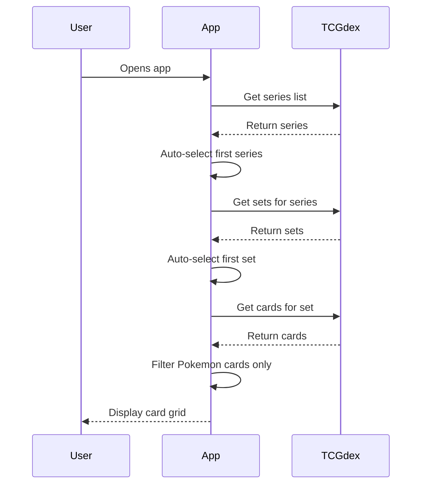
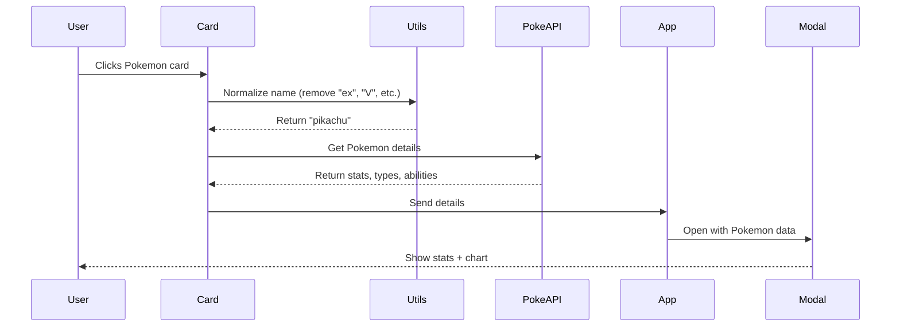
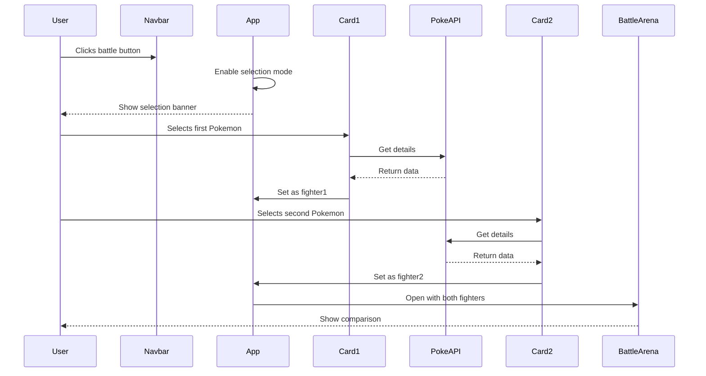
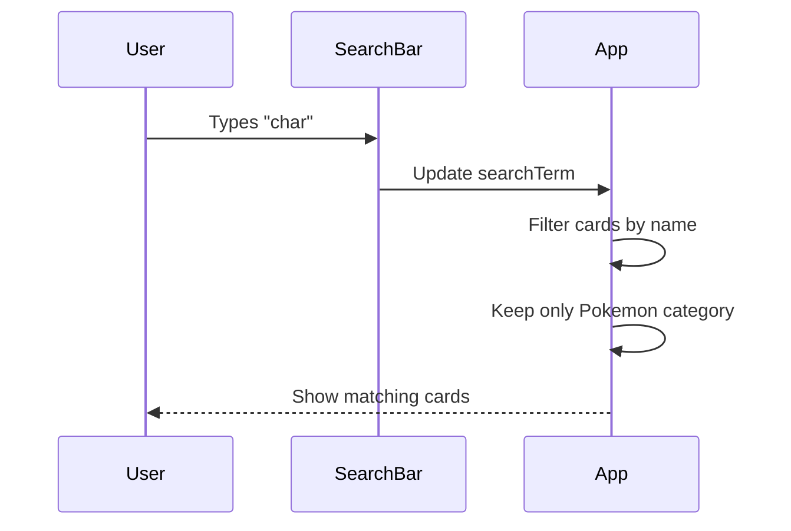

# PokeStats - Technical Documentation

Simple technical guide explaining how the app works, its architecture, and data flow.

## Table of Contents

1. [Architecture](#architecture)
2. [File Structure](#file-structure)
3. [How It Works](#how-it-works)
4. [Key Flows](#key-flows)
5. [Performance](#performance)

---

## Architecture

### Overview

```
App.tsx (Main State Container)
    ↓
Components (UI Display)
    ↓
Services (API Calls)
    ↓
External APIs (TCGdex + PokeAPI)
```

### Component Structure

```
App.tsx
├── Navbar (Series, Set selectors, Battle button, Search)
├── PokemonCard[] (Grid of cards)
├── PokemonDetail (Modal for card details)
└── BattleArena (Modal for comparison)
```

---

## File Structure

### Components
- **App.tsx** - Main app, manages all state
- **PokemonCard.tsx** - Individual card display with TCG image
- **PokemonDetail.tsx** - Pokemon details modal with stats
- **BattleArena.tsx** - Side-by-side Pokemon comparison
- **StatChart.tsx** - Radar chart visualization

### Services
- **tcgdex.ts** - Fetches TCG cards from TCGdex API
- **pokeapi.ts** - Fetches Pokemon data from PokeAPI

### Utils
- **pokemonHelpers.ts** - Shared functions for name normalization

### Types
- **types.ts** - TypeScript interfaces

---

## How It Works

### 1. App Initialization



**What happens:**
1. App loads → Fetches all TCG series
2. Auto-selects first series → Fetches sets
3. Auto-selects first set → Fetches cards
4. Filters to show only Pokemon cards (hides Trainers, Energy)
5. Displays cards in grid

### 2. Viewing Pokemon Details



**What happens:**
1. User clicks "Pikachu ex" card
2. Name normalized to "pikachu" (removes TCG suffix)
3. Fetches base Pokemon data from PokeAPI
4. Opens modal with stats, types, abilities
5. Same data shown for all Pikachu variants (ex, V, VMAX, etc.)

### 3. Battle Mode



**What happens:**
1. Click battle button → Selection mode activates
2. Yellow banner appears showing slots
3. Click first Pokemon → Added to Slot 1
4. Click second Pokemon → Added to Slot 2
5. Battle arena auto-opens with comparison
6. Shows stat bars + radar chart overlay

### 4. Search & Filter



**What happens:**
1. Type in search → Real-time filtering
2. Matches card names (case-insensitive)
3. Always filters out non-Pokemon cards
4. Updates grid instantly

---

## Key Flows

### State Management

**App.tsx holds all state:**

```javascript
// TCG Data
- series, sets, cardList, filteredList
- selectedSeries, selectedSet

// Modal State
- selectedPokemon (for detail view)

// Battle State
- fighter1, fighter2
- showComparison, isSelectionMode

// UI State
- loading, searchTerm
```

**State Updates:**

```
User Action → Handler → setState → Re-render → Updated UI
```

### Data Flow

**Props Down, Events Up:**

```
App
 │
 ├─> Pass data to PokemonCard (name, image, etc.)
 │
 └─< Receive events from PokemonCard (onClick, onBattleSelect)
```

### Name Normalization

**Why:** TCG cards have variants (ex, V, VMAX) but we want same Pokemon data

**How:**
```typescript
normalizePokemonName("Charizard ex") → "charizard"
normalizePokemonName("Pikachu VMAX") → "pikachu"
normalizePokemonName("Mewtwo & Mew GX") → "mewtwo"
```

**Result:** All variants show same base Pokemon stats

### Card Filtering

**Two filters always active:**

1. **Search Filter:** `name.includes(searchTerm)`
2. **Category Filter:** `category === 'Pokémon'`

**Result:** Only Pokemon cards matching search are shown

---

## Performance

### Optimizations Used

1. **Lazy Loading**
   - Images load only when visible
   - Pokemon details fetched on click, not mount

2. **Caching**
   - Pokemon details cached in component state
   - No redundant API calls for same Pokemon

3. **Smart Filtering**
   - Filter runs only when search or cardList changes
   - Fast client-side filtering

4. **Conditional Rendering**
   - Modals only render when open
   - Selection banner only shows when needed

5. **Image Optimization**
   - WebP format from TCGdex (smaller size)
   - Error fallbacks for failed loads

### API Usage

**TCGdex API:**
```
GET /series → List of TCG series
GET /sets?serie={id} → Sets in a series
GET /sets/{id} → Cards in a set
```

**PokeAPI:**
```
GET /pokemon/{name} → Pokemon details (stats, types, abilities)
```

**Error Handling:**
```typescript
try {
  const response = await fetch(url);
  return await response.json();
} catch (error) {
  console.error(error);
  return null; // Graceful failure
}
```

---

## Component Lifecycle

### App Component

```
Mount
  → Load series
    → Auto-select first series
      → Load sets
        → Auto-select first set
          → Load cards
            → Filter & display
```

### PokemonCard Component

```
Render
  → Show TCG card image
    → On click:
      → Normalize name
      → Fetch Pokemon details (if not cached)
      → Call parent callback
      → Parent opens modal
```

### Battle Selection

```
Idle
  → Click battle button
    → Selection mode ON
      → Select Pokemon 1 → fighter1 set
      → Select Pokemon 2 → fighter2 set
        → Auto-open battle arena
          → Show comparison
```

---

## State Transitions

### Battle Mode States

```
Normal Mode
    ↓ (click battle OR select Pokemon)
Selection Mode (can select fighters)
    ↓ (2 fighters selected)
Battle Arena Open (showing comparison)
    ↓ (close OR reset)
Normal Mode
```

### Filter States

```
All Cards Loaded
    ↓
Apply Category Filter (Pokemon only)
    ↓
Apply Search Filter (name match)
    ↓
Display Filtered Cards
```

---

## Code Patterns

### Component Communication

```typescript
// Parent to Child (Props)
<PokemonCard
  name={card.name}
  cardImage={card.image}
  onClick={handleClick}
/>

// Child to Parent (Callbacks)
onClick(pokemonDetails) // Emit event up
```

### Async Data Fetching

```typescript
const loadCards = async (setId: string) => {
  setLoading(true);
  const data = await fetchSetDetails(setId);
  if (data?.cards) {
    setCardList(data.cards);
  }
  setLoading(false);
};
```

### Effects with Dependencies

```typescript
useEffect(() => {
  if (selectedSeries) {
    loadSets(selectedSeries);
  }
}, [selectedSeries]); // Runs when selectedSeries changes
```

---

## Key Features Explained

### 1. Unified Pokemon Modals

**Problem:** "Charizard ex", "Charizard V", "Charizard VMAX" should show same data

**Solution:** Normalize name before API call
```typescript
normalizePokemonName(cardName) // Removes suffixes
  → fetchPokemonDetails(normalizedName) // Always fetches base form
```

### 2. Non-Pokemon Card Filtering

**Problem:** TCG sets include Trainer/Energy cards

**Solution:** Filter by category
```typescript
isPokemonCard(card.category) // Returns true only for Pokemon
```

### 3. Battle Selection

**Problem:** Need to select 2 Pokemon for comparison

**Solution:** Track in state
```typescript
fighter1, fighter2 // Store selected Pokemon
isSelectionMode // Show/hide selection UI
```

---

## Architecture Decisions

### Why Component State (not Redux)?

- Simple app with limited state
- State mostly in one place (App.tsx)
- No need for global store

### Why Separate Services?

- Clean separation: UI ↔ API logic
- Easy to test
- Reusable functions

### Why Name Normalization?

- TCG cards have many variants
- Users expect same Pokemon data
- Simplifies comparison logic

### Why Filter Non-Pokemon Cards?

- Users want to see Pokemon only
- Better UX
- Cleaner grid

---

## Summary

**PokeStats is a React app that:**

1. Loads TCG cards from TCGdex API
2. Shows Pokemon cards (filters out Trainers/Energy)
3. Normalizes card names to get base Pokemon data from PokeAPI
4. Displays Pokemon stats with charts
5. Allows comparing two Pokemon in a battle arena

**Key Technologies:**
- React 19 + TypeScript
- Vite (build tool)
- Recharts (charts)
- TCGdex API (card images)
- PokeAPI (Pokemon data)

**Key Patterns:**
- Component-based architecture
- Props down, events up
- Async/await for API calls
- useEffect for side effects
- Graceful error handling
